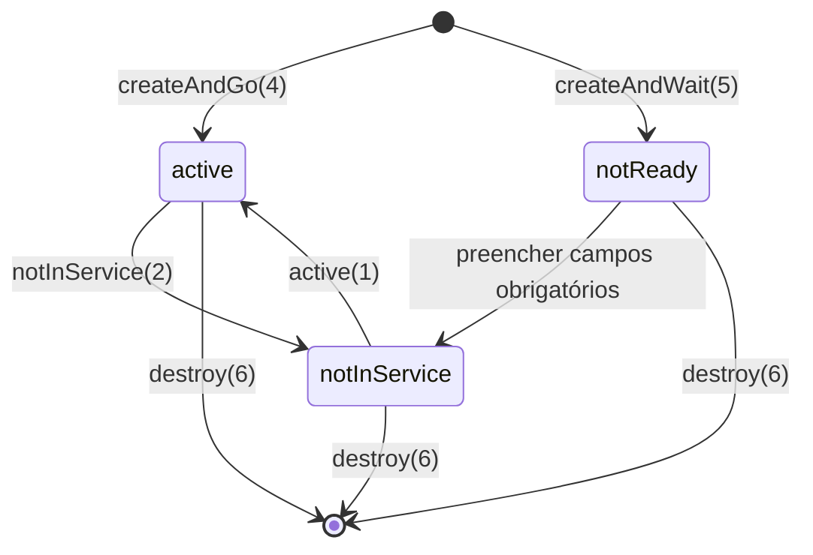

# HOW-TO

## Como addicionar linhas a uma tabela?

Valores possíveis do *RowStatus*

| Value | Symbolic Name   | Description |
|-------|------------------|------------|
| 1     | active           | The conceptual row is available for use. |
| 2     | notInService     | The row exists but is not currently active. |
| 3     | notReady         | The row exists but required objects are not properly initialized. |
| 4     | createAndGo      | Create and activate the row in one operation. |
| 5     | createAndWait    | Create the row but do not activate it yet. |
| 6     | destroy          | Remove the row from the table. |


### Fluxograma

```
                     +------------------+
                     |   (Linha não     |
                     |     existe)      |
                     +------------------+
                               |
                               | createAndGo(4)
                               v
                        +---------------+
                        |    active     |
                        +---------------+
                               ^
                               |
                               | active(1)
                               |
                        +---------------+
                        | notInService  |
                        +---------------+
                               ^
                               |
                               | createAndWait(5)
                               |
                     +------------------+
                     |    notReady      |
                     | (faltam campos)  |
                     +------------------+
```

Em qualquer estado existente:
--------------------------------
destroy(6)  →  Linha removida


### Diagrama de estados mais complexo




## Adicionar uma nova sala?

```
snmpset -v2c -c private localhost \
  CLASSROOM-MIB::building.101 s "B1" \
  CLASSROOM-MIB::capacity.101 u 30 \
  CLASSROOM-MIB::roomRowStatus.101 i 4

```

## Qual a capacidade de todas as salas?

```
snmpwalk -v2c -c public localhost CLASSROOM-MIB::capacity
```

## Qual a capacidade da sala X?

```
snmpget -v2c -c public localhost CLASSROOM--MIB::capacity."2.25"
```

