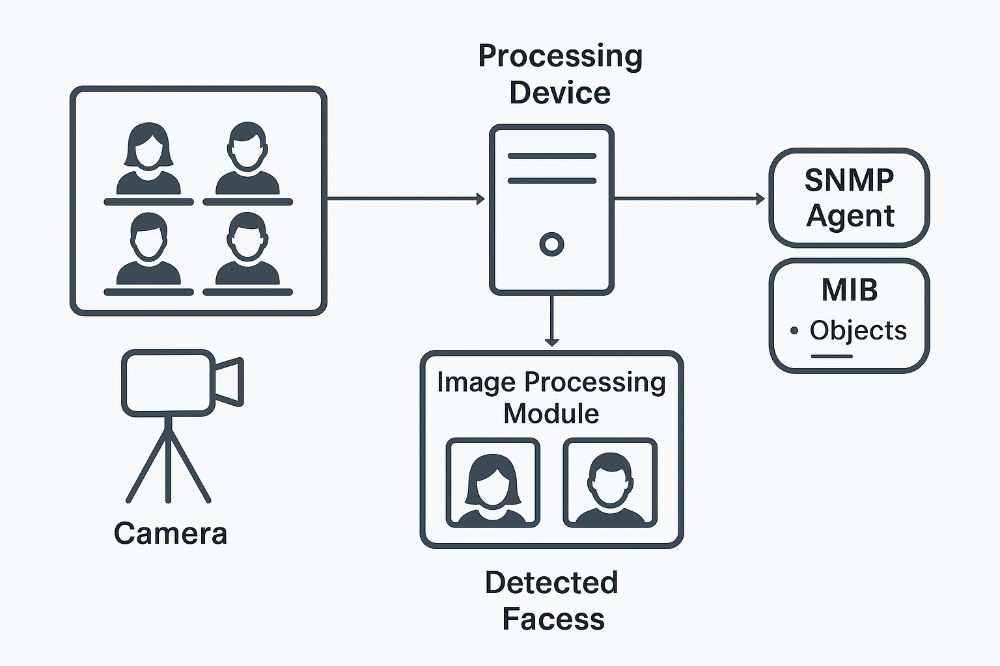
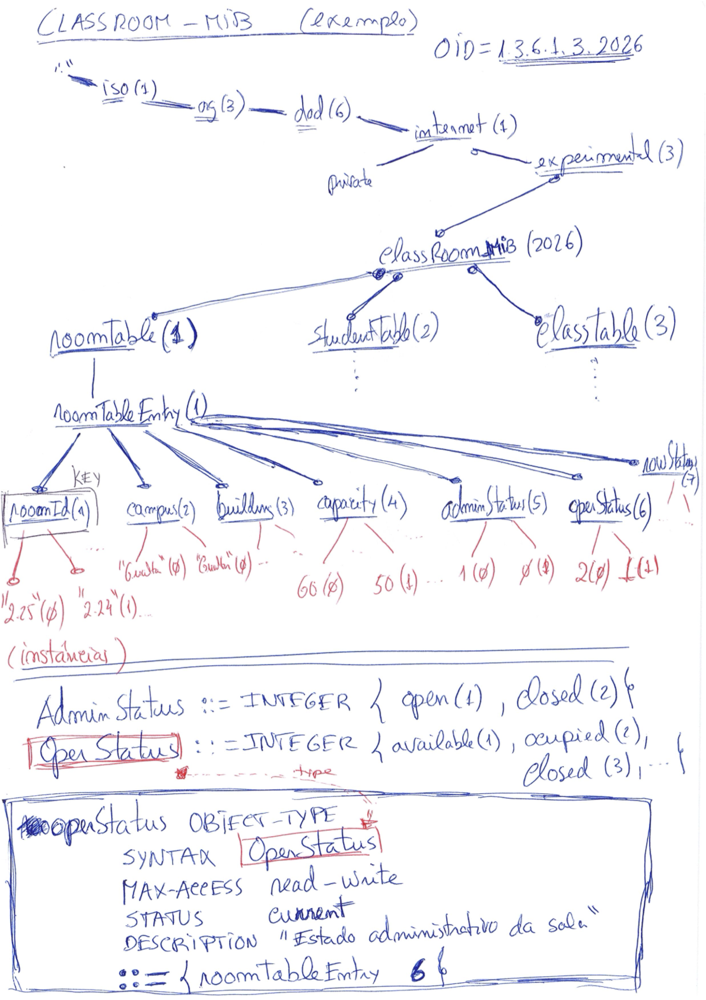
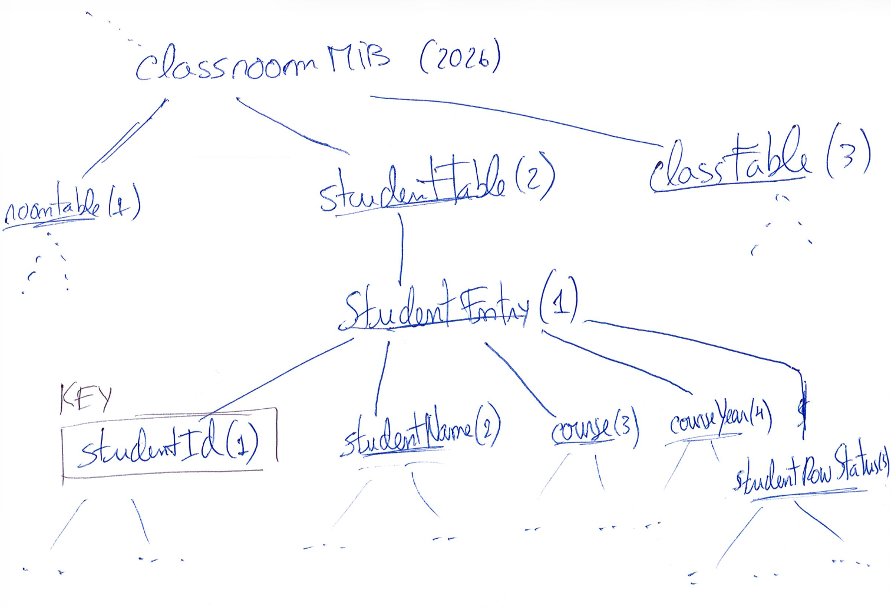

# SNMP Demo -  Exercicio MIB

## Problema

- registar presenças dos alunos numa sala de aula via SNMP :-)

## Pressupostos

- existe uma câmara de filmar que captura imagem da sala
- os alunos são identificados por módulo de identificação de rosto (vamos fingir que não há RGPD :-) )
- os objetos são definidos numa MIB experimental 
- agente SNMP simulado com snmsim
- estação de gestão com net-snmp (linha de comando)

## Figura



## Ferramentas a usar

- [SMI Tools](https://www.ibr.cs.tu-bs.de/projects/libsmi/tools.html): para validar a MIB (validar e corrigir a syntaxe)
- [snmpsim](https://docs.lextudio.com/snmpsim/): simulador do agente snmp
- [net-snmp](https://www.net-snmp.org/) ou [PySNMP](https://docs.lextudio.com/snmp/) para clientes de linha (snmpget, snmpbulkget, etc)

## Como instalar (Ubuntu ou Windows WSL):

| **Package**           | **Como instalar**                          | **Descrição**                                  |
| --------------------- | ------------------------------------------ | ---------------------------------------------- |
| **SNMP Simulator**    | pip install snmpsim                        | snmpsim-command-responder, snmpsim-record-mibs |
| **libsmi / smitools** | sudo apt install smitools                  | smilint, smidump                               |
| **Net-SNMP**          | sudo apt install snmp snmp-mibs-downloader | snmpget, snmpwalk, etc.                        |
| **PySNMP**            | pip install --upgrade pysnmp pysmi         | snmpget, snmpwalk, etc.                        |

Ver o que está instalado no python:
```bash
pip show snmpsim pysnmp pysmi pysnmp-mibs snmpsim-data
```

Ver o que está obsoleto 
```bash
pip list --outdated
```

Atualização para última versão (opcional)
```bash
pip install --upgrade ssnmpsim pysnmp pysmi pysnmp-mibs snmpsim-data
```

## Como instalar (MacOS)

NOTA: usar *apenas uma* das ferramentas de gestão de pacotes [brew](https://brew.sh/) ou [port](https://www.macports.org/), de acordo com a sua preferência

- ou com mac brew 
```
brew install libsmi
sudo port install libsmi 
```

- ou com MacPorts
```
sudo port install libsmi 
```

E depois instalar do mesmo modo os módulos python com pip install...


## Teste rápido das ferramentas

```bash
smilint -h
smidump -h
smidump -f tree IF-MIB
snmpget
snmpwalk
snmpsim-command-responder
```

## Criação e teste da MIB

### Sumário

- **Etapa 1**: Planear a MIB (definir objetos, syntax, acesso) e a SMI (árvore de OIDs dos objetos definidos)
- **Etapa 2**: Descarregar uma MIB exemplo NET-SNMP  para facilitar a edição/criação da nova MIB
- **Etapa 3**: Editar a MIB de acordo com o planeamento feito
- **Etapa 4**: Validar a MIB com a ferramenta **smilint**
- **Etapa 5**: Inventar dados para simular a MIB (à mão ou com gerador de dados)
- **Etapa 6** Executar o simulador - agente SNMP com os dados gerados
- **Etapa 7**: Interrogar o agente (testes)

### Etapa 1:  Planear a MIB e a SMI

- Nome do módulo (em letras maiúsculas): CLASSROOM-MIB
- Prefixo a usar nos objetos (em letras minúsculas):  classroom
- OID da raíz da MIB (top-level OID): abaixo de experimental(1.3.6.1.3), usando OID 2026

```md
iso(1).org(3).dod(6).internet(1).experimental(3)
  └─ classroomMIB(2026)
     ├─ roomTable(1)
     └─ studentTable(2)
     └─ classTable(3)
     ...
```

#### iIdentificar objetos e atributos genericamente

Nesta etapa 1 é fundamental identxtificar os objetos e seus atributos, pensando calmamente no que queremos representar
  
  Objetos:
  - Uma sala, tem um id (inteiro), um nome (string), capacidade (inteiro), estado (conjunto de valores), estado administrativo (conjunto de valores)
  - Depois temos uma tabela com o numero do lugar, estudante que lá está (nº de estudante, nome, ano, curso)

  - *room*: roomId, campus, building, capacity, estado (administrativo e operacional da sala)
  - *student*: studentId, studentName, course, year ... 
  - *class*: roomId, studentId, datetime, UC, ... (?)

  Syntaxe:
  - Integer32, DisplayString, SEQUENCE OF...

  Acesso por objeto:
  - not-acessible, read-only, read-write, read-create, ....

ACESSOS

| **MAX-ACCESS value**      | **Meaning**                                                                            | **Typical usage**                                                    |
| --------------------- | ---------------------------------------------------------------------------------- | ---------------------------------------------------------------- |
| **not-accessible**        | Object exists for indexing or structure only; cannot be retrieved or set directly. | Table & entry nodes; index columns                               |
| **read-only**             | Can only be read (GET, GETNEXT, GETBULK).                                          | Counters, status, statistics                                     |
| **read-write**            | Can be read and modified (GET, SET).                                               | Configurable parameters                                          |
| **read-create**           | Same as read-write, _plus_ the ability to create new table rows.                     | Columns in tables that support dynamic creation (with RowStatus) |
| **accessible-for-notify** | Used only in notification definitions.                                             | Trap/notification parameters                                     |

#### MIB tree

Nesta fase e antes dos detalhes por objecto, é melhor desenhar a MIB em árvore



Sala de aula:

- roomName (DisplayString), **read-write**
- roomCapacity (Integer32), **read-write**
- roomOperStatus (INTEGER { available(1), occupied(2), closed(3) }), **read-write** (runtime)
- roomAdminStatus (INTEGER { up(1), down(2) }), **read-write** (optional control)

Tabela de estudantes detetados pela camara e módulo de processamento de imagem:
- studentTable (table), studentEntry (row)
    - id (Unsigned32), not-accessible (index)
    - studentName (DisplayString), **read-create**   
    - studentYear (INTEGER { first(1), second(2), third(3), fourth(4), fifth(5), other(99) }), **read-create**
    - studentCourse (DisplayString), **read-create**
    - status  (RowStatus), **read-create** (para gerir esta linha da tabela: apagar, criar, alterar)



### Etapa 2:  Descarregar MIB exemplo

```bash
wget http://net-snmp.sourceforge.net/docs/mibs/NET-SNMP-EXAMPLES-MIB.txt
cp NET-SNMP-EXAMPLES-MIB.txt CLASSROOM-MIB.mib
```

### Etapa 3:  Editar MIB de acordo com o planeamento

Esta primeira versão tem naturalmente um conjunto de erros, que podem ser corrigidos depois da compilação, seguindo as dicas do compilador:


```mib
CLASSROOM-MIB DEFINITIONS ::= BEGIN

--
-- MIB objects for classroom monitoring example implementations
--

IMPORTS
    MODULE-IDENTITY, OBJECT-TYPE, Integer32,
    NOTIFICATION-TYPE                       FROM SNMPv2-SMI
    RowStatus, StorageType                  FROM SNMPv2-TC
    InetAddressType, InetAddress            FROM INET-ADDRESS-MIB
;

-- MODLUE IDENTITY: classromMIB
-- REVISION e LAST-UPDATED sao datas no formato AAAAMMDDHHMM
-- Tem de haver um REVISION igual a LAST-UPDATED 


classroomMIB MODULE-IDENTITY
    LAST-UPDATED "202602R27000Z"
    ORGANIZATION "www.net-snmp.org"
    CONTACT-INFO    
    "postal:   Campus de Gualtar
                4710-057 BRAGA
                Portugal
      email:    costa@di.uminho.pt"

    "Exercício MIB presenças na sala de Aula"
    DESCRIPTION
    "MIB objects for classroom monitoring example implementations"
    REVISION     "202602270000Z"
    DESCRIPTION
    "Classroom monitoring MIB: rooms, students and classses."
    ::= { experimental 2026 }

...

END

```


### Etapa 4:  Validar a MIB

Neste repositório há duas versões da MIB, uma já corrigida (OK) e outra com muitos erros (NOTOK) que pode ser usada para testes.

A ferramenta smilint suporta uma  opção -l para definir o nível de avisos que são enviados (warnings). O default é 3. Podemos aumentar.

Devemos primeiro liminar primeiro apenas os erros mais graves, colocando a verbosidade a 3 apenas:

```bash
smilint -s -m -l 3  ./CLASSROOM-MIB.mib
```

... e depois aumentar a verbosidade do compilador para tratar outros avisos:

```bash
smilint -s -m -l 6 ./CLASSROOM-MIB.mib
```

Idealmente devemos ter 0 erros e 0 avisos!
Depois será melhor copiar a MIB validada para a uma das pastas em que as ferramentas SNMP as podem ler. Normalmente em ```~/snmp/mibs``` mas pode ser noutro local. 

```bash
mkdir -p ~/snmp/mibs
cp ./CLASSROOM-MIB.mib ~/snmp/mibs/CLASSROOM-MIB.txt
```

O que é obrigatório fazer é definir as variáveis de ambiente adequadas para ajudar a localizar as MIBS. Algo do género, que pode mesmo ser colocado no ficheiro de configuração da bash ```.bashrc```ou equivalente:

Em **Linux/Windows** deve bastar algo como:
```bash
export MIBDIRS=$HOME/snmp/mibs:/usr/share/snmp/mibs
export MIBS=+ALL
```

Em **MacOS**, supondo que se usa *Homebrew* ou *MacPorts*, talvez acrescentar essas duas pastas adicionais:
```bash
export MIBDIRS=$HOME/snmp/mibs:/usr/share/snmp/mibs:/opt/local/share/snmp/mibs:/opt/homebrew/share/snmp/mibs
export MIBS=+ALL
```

O que permitirá ver traduzir os OID de números para nomes e vice-versa. Passará a ser indiferente usar uns ou outros. Podemos testar com:

```bash
snmptranslate -Td -OS CLASSROOM-MIB::studentTable
```

Nesta altura deveremos ter uma versão da MIB já sem errors nenhuns. 
Algo do género de (**CLASSROOM-MIB.mib**)

### Etapa 5:  Inventar dados para simulação

Correr o mib compiler, que provavelmente se pode executar apenas como **mibdump**

```bash 
mibdump --help
```

No entanto, se o comando não existir, pode-se correr desta outra forma, e, nesse caso, fará sentido criar um *alias* para ter o comando na forma alternativa mibdump:

```bash
python -m pysmi.tools.mibdump --help
alias mibdump="python -m pysmi.tools.mibdump"
mibdump --help
```

Criar diretorias e compilar a MIB para Python para que as ferramentas do PySNMP as possam usar (simulador, gerador de dados, etc):

```bash
mkdir -p ~/snmp/mibs
mkdir -p ~/.pysnmp/mibs
mibdump  --mib-source ~/snmp/mibs --destination-directory ~/.pysnmp/mibs ./CLASSROOM-MIB.mib
```

A operação anterior deve criar uma versão python na pasta ```~/.pysnmp/mibs```. Confirmar com um comando ```ls -lisat ~/.pysnmp/mibs```.

E depois gerar os dados, totalmente aleatórios e sem sentido (*classroom-auto.snmprec*):

```bash
mkdir -p data
snmpsim-record-mibs --mib-module CLASSROOM-MIB --output-file data/classroom-auto.snmprec
```

Podemos limitar os dados a um OID inicial (start-object) e um OID final (stop-object). Por exemplo, gerar dados apenas para tabela de salas 
e de alunos mas não gerar presenças na sala de aula:

```bash
mkdir -p data
snmpsim-record-mibs --mib-module CLASSROOM-MIB --output-file data/classroom-auto.snmprec --start-object CLASSROOM-MIB::roomTable --stop-object CLASSROOM-MIB::classTable
```


ou gerar de forma mais manual e controlada (2 alunos, com nomes editados):

```bash
mkdir -p data
snmpsim-record-mibs --mib-module CLASSROOM-MIB --output-file data/classroom-manual.snmprec --table-size=2 --manual-values
```

NOTA: este gerador de dados, não gosta de tipos complexos e pode dar erro. O ChatGPT ou outos LLM, podem gerar dados no formato pretendido (snmprec) desde que conheçam a MIB.

Exemplo de dados num ficheiro criado manualmente (*classroom-manual.snmprec*):

```txt
# =========================================
# CLASSROOM-MIB simulated data
# =========================================

# ---------- ROOM TABLE ----------
# Tabela usa DisplayString como índice, portanto o SNMP codifica assim:
# <length>.<ascii>.<ascii>...
# roomId."2.24" ==> lenght 4, 2 -> 50;  . -> 46;  2 -> 50; 4 -> 52

# roomId
1.3.6.1.3.2026.1.1.1.4.50.46.50.52|4|2.24
1.3.6.1.3.2026.1.1.1.4.50.46.50.53|4|2.25

# campus
1.3.6.1.3.2026.1.1.2.4.50.46.50.52|4|Gualtar
1.3.6.1.3.2026.1.1.2.4.50.46.50.53|4|Gualtar

# building
1.3.6.1.3.2026.1.1.3.4.50.46.50.52|4|DI
1.3.6.1.3.2026.1.1.3.4.50.46.50.53|4|DI

# capacity
1.3.6.1.3.2026.1.1.4.4.50.46.50.52|66|40
1.3.6.1.3.2026.1.1.4.4.50.46.50.53|66|30

# adminStatus
1.3.6.1.3.2026.1.1.5.4.50.46.50.52|2|1
1.3.6.1.3.2026.1.1.5.4.50.46.50.53|2|1

# operStatus
1.3.6.1.3.2026.1.1.6.4.50.46.50.52|2|1
1.3.6.1.3.2026.1.1.6.4.50.46.50.53|2|1


# ---------- STUDENT TABLE ----------

# studentId
1.3.6.1.3.2026.2.1.1.5.97.56.56.56.56|4|a8888
1.3.6.1.3.2026.2.1.1.5.97.57.57.57.57|4|a9999

# studentName
1.3.6.1.3.2026.2.1.2.5.97.56.56.56.56|4|Joao Silva
1.3.6.1.3.2026.2.1.2.5.97.57.57.57.57|4|Ana Costa

# course
1.3.6.1.3.2026.2.1.3.5.97.56.56.56.56|4|LEI
1.3.6.1.3.2026.2.1.3.5.97.57.57.57.57|4|LEI

# courseYear
1.3.6.1.3.2026.2.1.4.5.97.56.56.56.56|2|3
1.3.6.1.3.2026.2.1.4.5.97.57.57.57.57|2|2

# ---------- CLASS TABLE ----------
# roomId="2.24", studentId="a9999", classDateTime="05-03-2026 13:00"

1.3.6.1.3.2026.3.1.4.4.50.46.50.52.5.97.57.57.57.57.16.48.53.45.48.51.45.50.48.50.54.32.49.51.58.48.48|4|Network Management
1.3.6.1.3.2026.3.1.5.4.50.46.50.52.5.97.57.57.57.57.16.48.53.45.48.51.45.50.48.50.54.32.49.51.58.48.48|2|12

```

### Etapa 6:  Executar o simulador

```bash
snmpsim-command-responder --data-dir ./data --agent-udpv4-endpoint 127.0.0.1:2001
```

O simulador indica que as comunidades de acesso são derivados do nome dos ficheiros de dados. Por exemplo o ficheiro *classroom-manual.snmprec* é carregado pelo agente e deve ser acedido com a comunidade "classroom-manual". Por seu lado o ficheiro de dados *classroom-auto.snmprec* é também carregado pelo agente mas acessível comunidade "classroom-auto".

### Etapa 7:  Interrogar e testar o agente

```bash
snmpwalk -v2c -c classroom-manual 127.0.0.1:2001 experimental.classroomMIB
snmpwalk -v2c -c classroom-manual 127.0.0.1:2001 .1.3.6.1.3.2026
snmpwalk -v2c -c classroom-manual  127.0.0.1:2001 CLASSROOM-MIB::classroomMIB

snmptable -v2c -c classroom-manual  127.0.0.1:2001 CLASSROOM-MIB::studentTable
snmptable -v2c -c classroom-manual  127.0.0.1:2001 CLASSROOM-MIB::roomTable

snmpwalk -v2c -c classroom-auto 127.0.0.1:2001 experimental.classroomMIB
snmpwalk -v2c -c classroom-auto 127.0.0.1:2001 .1.3.6.1.3.2026
snmpwalk -v2c -c classroom-auto  127.0.0.1:2001 CLASSROOM-MIB::classroomMIB

snmptable -v2c -c classroom-auto  127.0.0.1:2001 CLASSROOM-MIB::studentTable
snmptable -v2c -c classroom-auto  127.0.0.1:2001 CLASSROOM-MIB::roomTable

```

## Perguntas

- Como responder às seguintes perguntas  (comandos SNMP):
    - "quantos lugares tem a sala X"
    - "quantos alunos estão na sala Y"
    - "quais os números e nomes dos alunos nos 3 primeiros lugares sentados"
- Implemente um cliente SNMP simples (ex: usando PySNMP) para obter uma das respostas anteriores
- Pense num algoritmo para marcar as presenças dos alunos na aula de GVR (por exemplo)

Exemplo de queries:

```bash
snmpget -v2c -c classroom-manual 127.0.0.1:2001 CLASSROOM-MIB::capacity.\"2.24\"

snmpget -v2c -c classroom-manual 127.0.0.1:2001 'CLASSROOM-MIB::capacity."2.24"'

snmpset -v2c -c classroom-manual 127.0.0.1:2001 \
  CLASSROOM-MIB::campus.\"2.26\" s "Gualtar" \
  CLASSROOM-MIB::building.\"2.26\" s "DI" \
  CLASSROOM-MIB::capacity.\"2.26\" u 40 \
  CLASSROOM-MIB::adminStatus.\"2.26\" i 1 \
  CLASSROOM-MIB::roomRowStatus.\"2.26\" i 40

```
## Referências

- [git snmp-demo (Exercicio SNMP)](https://github.com/adcosta/snmp-demo)
- [RFC 2579 Textual Conventions for SMIv2](https://www.rfc-editor.org/rfc/rfc2579.html)
- [libsmi - A Library to Access SMI MIB Information](https://www.ibr.cs.tu-bs.de/projects/libsmi/)
- [libsmi - Tools](https://www.ibr.cs.tu-bs.de/projects/libsmi/tools.html)
- [Complete MIB Database - All SNMP MIBs and OIDs](https://mibs.observium.org/all/)
- [net-snmpmibs](https://github.com/hardaker/net-snmp/tree/master/mibs)
- [Net-SNMP MIBs](https://www.net-snmp.org/docs/mibs/)
- [Net-SNMP](https://www.net-snmp.org/)
- [PySNMP 7 Homepage](https://docs.lextudio.com/snmp/)
- [SNMP Simulator Documentation](https://docs.lextudio.com/snmpsim/)

