# CLASSROOM-MIB — OID Tree

| | |
|---|---|
| **Module** | `CLASSROOM-MIB` |
| **OID** | `1.3.6.1.3.2026` |
| **Path** | `iso(1).org(3).dod(6).internet(1).experimental(3).classroomMIB(2026)` |
| **Updated** | 2026-02-27 |

---

## ASCII Tree (universal — diffs perfeitos no git)

Ficheiro separado: [`classroom-mib-tree.txt`](./classroom-mib-tree.txt)

```
CLASSROOM-MIB — OID: 1.3.6.1.3.2026

iso(1).org(3).dod(6).internet(1).experimental(3)
└── classroomMIB(2026)                             [MODULE-IDENTITY]
    ├── roomTable(1)                               [NA] SEQUENCE OF RoomEntry
    │   └── roomEntry(1)                           [NA] INDEX { roomId }
    │       ├── roomId(1)                        ★ [NA] DisplayString(0..12)
    │       ├── campus(2)                          [RC] DisplayString(0..64)
    │       ├── building(3)                        [RC] DisplayString(0..64)
    │       ├── capacity(4)                        [RC] Unsigned32
    │       ├── adminStatus(5)                     [RC] {open,reserved,closed}
    │       ├── operStatus(6)                      [RO] {free,inUse,unusable}
    │       └── roomRowStatus(7)                   [RC] RowStatus
    ├── studentTable(2)                            [NA] SEQUENCE OF StudentEntry
    │   └── studentEntry(1)                        [NA] INDEX { studentId }
    │       ├── studentId(1)                     ★ [NA] DisplayString(0..12)
    │       ├── studentName(2)                     [RC] DisplayString(0..128)
    │       ├── course(3)                          [RC] DisplayString(0..128)
    │       ├── courseYear(4)                      [RC] {first..fifth}
    │       └── studentRowStatus(5)                [RC] RowStatus
    ├── classTable(3)                              [NA] SEQUENCE OF ClassEntry
    │   └── classEntry(1)                          [NA] INDEX { roomId, studentId, classDateTime }
    │       ├── classRoomId(1)                   ☆ [NA] DisplayString(0..12)
    │       ├── classStudentId(2)                ☆ [NA] DisplayString(0..12)
    │       ├── classDateTime(3)                 ☆ [NA] DateAndTime
    │       ├── className(4)                       [RC] DisplayString(0..128)
    │       ├── position(5)                        [RC] Integer32(0..999)
    │       └── classRowStatus(6)                  [RC] RowStatus
    └── classroomMibConformance(4)
        ├── classroomMibGroups(1)
        │   ├── roomGroup(1)       [OBJECT-GROUP]  campus,building,capacity,adminStatus,operStatus
        │   ├── studentGroup(2)    [OBJECT-GROUP]  studentName,course,courseYear
        │   ├── classGroup(3)      [OBJECT-GROUP]  className,position
        │   └── controlGroup(4)    [OBJECT-GROUP]  *RowStatus objects
        └── classroomMibCompliances(2)
            └── classroomMibCompliance(1)  [MODULE-COMPLIANCE]
                  MANDATORY: roomGroup, studentGroup, classGroup
                  OPTIONAL:  controlGroup

★ = simple index    ☆ = compound index
```

---

## Mermaid (renderiza no GitHub / GitLab)

Ficheiro separado: [`classroom-mib-tree.mmd`](./classroom-mib-tree.mmd)

```mermaid
%%{init: {
  "theme": "base",
  "themeVariables": {
    "primaryColor":        "#1A4F7A",
    "primaryTextColor":    "#FFFFFF",
    "primaryBorderColor":  "#0D3055",
    "lineColor":           "#556677",
    "fontSize":            "12px",
    "fontFamily":          "monospace"
  }
}}%%

graph TD

  iso["iso(1)"]
  org["org(3)"]
  dod["dod(6)"]
  internet["internet(1)"]
  experimental["experimental(3)"]
  classroomMIB["<b>CLASSROOM-MIB</b><br/>━━━━━━━━━━━━━━━━━━━━━━<br/>OID: 1.3.6.1.3.2026<br/><i>MODULE-IDENTITY</i>"]

  roomTable["<b>roomTable</b>(1)<br/>SEQUENCE OF RoomEntry · NA"]
  roomEntry["<b>roomEntry</b>(1)<br/>INDEX { roomId } · NA"]
  roomId["★ roomId(1)<br/>DisplayString(0..12) · NA<br/><b>INDEX</b>"]
  campus["campus(2)<br/>DisplayString(0..64) · RC"]
  building["building(3)<br/>DisplayString(0..64) · RC"]
  capacity["capacity(4)<br/>Unsigned32 · RC"]
  adminStatus["adminStatus(5)<br/>{open · reserved · closed} · RC"]
  operStatus["operStatus(6)<br/>{free · inUse · unusable} · RO"]
  roomRowStatus["roomRowStatus(7)<br/>RowStatus · RC"]

  studentTable["<b>studentTable</b>(2)<br/>SEQUENCE OF StudentEntry · NA"]
  studentEntry["<b>studentEntry</b>(1)<br/>INDEX { studentId } · NA"]
  studentId["★ studentId(1)<br/>DisplayString(0..12) · NA<br/><b>INDEX</b>"]
  studentName["studentName(2)<br/>DisplayString(0..128) · RC"]
  course["course(3)<br/>DisplayString(0..128) · RC"]
  courseYear["courseYear(4)<br/>{first · second · third<br/>fourth · fifth} · RC"]
  studentRowStatus["studentRowStatus(5)<br/>RowStatus · RC"]

  classTable["<b>classTable</b>(3)<br/>SEQUENCE OF ClassEntry · NA"]
  classEntry["<b>classEntry</b>(1)<br/>INDEX { roomId, studentId,<br/>classDateTime } · NA"]
  classRoomId["☆ classRoomId(1)<br/>DisplayString(0..12) · NA<br/><b>COMPOUND INDEX</b>"]
  classStudentId["☆ classStudentId(2)<br/>DisplayString(0..12) · NA<br/><b>COMPOUND INDEX</b>"]
  classDateTime["☆ classDateTime(3)<br/>DateAndTime · NA<br/><b>COMPOUND INDEX</b>"]
  className["className(4)<br/>DisplayString(0..128) · RC"]
  position["position(5)<br/>Integer32(0..999) · RC"]
  classRowStatus["classRowStatus(6)<br/>RowStatus · RC"]

  conformance["<b>classroomMibConformance</b>(4)<br/><i>OBJECT IDENTIFIER</i>"]
  groups["classroomMibGroups(1)"]
  compliances["classroomMibCompliances(2)"]
  roomGroup["roomGroup(1)<br/><i>OBJECT-GROUP</i>"]
  studentGroup["studentGroup(2)<br/><i>OBJECT-GROUP</i>"]
  classGroup["classGroup(3)<br/><i>OBJECT-GROUP</i>"]
  controlGroup["controlGroup(4)<br/><i>OBJECT-GROUP</i>"]
  compliance["classroomMibCompliance(1)<br/><i>MODULE-COMPLIANCE</i>"]

  iso --> org --> dod --> internet --> experimental --> classroomMIB

  classroomMIB --> roomTable
  roomTable --> roomEntry
  roomEntry --> roomId
  roomEntry --> campus
  roomEntry --> building
  roomEntry --> capacity
  roomEntry --> adminStatus
  roomEntry --> operStatus
  roomEntry --> roomRowStatus

  classroomMIB --> studentTable
  studentTable --> studentEntry
  studentEntry --> studentId
  studentEntry --> studentName
  studentEntry --> course
  studentEntry --> courseYear
  studentEntry --> studentRowStatus

  classroomMIB --> classTable
  classTable --> classEntry
  classEntry --> classRoomId
  classEntry --> classStudentId
  classEntry --> classDateTime
  classEntry --> className
  classEntry --> position
  classEntry --> classRowStatus

  classroomMIB --> conformance
  conformance --> groups
  conformance --> compliances
  groups --> roomGroup
  groups --> studentGroup
  groups --> classGroup
  groups --> controlGroup
  compliances --> compliance

  classDef oidpath   fill:#E4EFF7,stroke:#9BB8CC,color:#33495E,font-style:italic
  classDef module    fill:#1A4F7A,stroke:#0D3055,color:#FFFFFF,font-weight:bold
  classDef table     fill:#1A6B45,stroke:#0D4A2E,color:#FFFFFF,font-weight:bold
  classDef entry     fill:#2E9B65,stroke:#1A6B45,color:#FFFFFF
  classDef index     fill:#C0392B,stroke:#922B21,color:#FFFFFF,font-weight:bold
  classDef compindex fill:#8E44AD,stroke:#6C3483,color:#FFFFFF,font-weight:bold
  classDef colRC     fill:#EAF6EA,stroke:#6ABF82,color:#1A4A28
  classDef colRO     fill:#EBF5FB,stroke:#7FB3D3,color:#1A3A5A
  classDef rowstatus fill:#F4ECF7,stroke:#A569BD,color:#4A235A
  classDef conform   fill:#F5F5F0,stroke:#BBBBAA,color:#444433,font-style:italic

  class iso,org,dod,internet,experimental oidpath
  class classroomMIB module
  class roomTable,studentTable,classTable table
  class roomEntry,studentEntry,classEntry entry
  class roomId,studentId index
  class classRoomId,classStudentId,classDateTime compindex
  class campus,building,capacity,adminStatus,studentName,course,courseYear,className,position colRC
  class operStatus colRO
  class roomRowStatus,studentRowStatus,classRowStatus rowstatus
  class conformance,groups,compliances,roomGroup,studentGroup,classGroup,controlGroup,compliance conform
```



---

## PlantUML WBS (diagrama rico com cores e anotações)

Ficheiro separado: [`classroom-mib-tree.puml`](./classroom-mib-tree.puml)
Renderiza em: [PlantUML online](https://www.plantuml.com/plantuml/uml/) · VS Code (extensão PlantUML) · GitLab nativo

---

## Legenda de acessos

| Código | MAX-ACCESS      | Uso típico                                    |
|--------|-----------------|-----------------------------------------------|
| `NA`   | not-accessible  | Nós de tabela/entry e colunas índice          |
| `RO`   | read-only       | Estado operacional (runtime, só de leitura)   |
| `RW`   | read-write      | Parâmetros configuráveis (sem RowStatus)      |
| `RC`   | read-create     | Colunas de tabelas com RowStatus              |

★ = índice simples  &nbsp;&nbsp;  ☆ = índice composto (classTable usa 3 colunas como chave)

---

## Textual Conventions

```
RoomAdminStatus   ::= INTEGER { open(1), reserved(2), closed(3) }
RoomOperStatus    ::= INTEGER { free(1), inUse(2), unusable(3) }
StudentCourseYear ::= INTEGER { first(1), second(2), third(3), fourth(4), fifth(5) }
```
